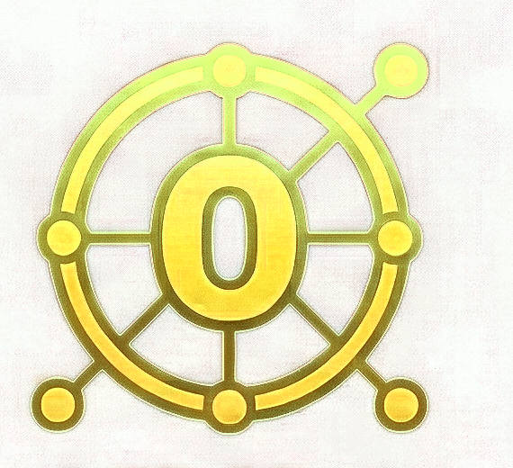

# Orrbeam — Brand

**Tagline:** Hypervisor & Remote Config (also: unified Sunshine/Moonlight mesh)

The image at `branding/logo.png` is the **definitive logo** for orrbeam. It was
cropped from the authoritative icon sheet at
`~/projects/personal_icon_pack.png`. Do not substitute, recolor, or redraw.

## Glyph

A ship's wheel / helm in gold: an "O" at the hub, six spokes radiating to a
ring, six round grips on the rim. One grip extends slightly further out —
the active node the user is currently steering. Half navigational tool, half
mesh map.

## Color palette

| Role       | Hex        | Name            | Use                                     |
|------------|------------|-----------------|-----------------------------------------|
| Primary    | `#F8D808`  | Beacon Gold     | Brand yellow, active node, connect btn  |
| Highlight  | `#887808`  | Brass Helm      | Hover, focus, secondary buttons         |
| Mid        | `#787808`  | Worn Brass      | Dividers, inactive nodes                |
| Deep       | `#786808`  | Aged Brass      | Borders, muted text on light            |
| Shadow     | `#685808`  | Dark Patina     | Dark-mode background, deep shadow       |
| Accent     | `#785808`  | Tarnish Gold    | Error-state lining (brass, not red)     |

## Usage

- This is a **Tauri v2 + React + Tailwind** app. Map the palette to
  `tailwind.config.js` as `brand.primary`, `brand.highlight`, etc., and
  consume via `bg-brand-primary`, `text-brand-deep`.
- The **active node** in the mesh view should always render in Beacon Gold
  at full opacity; inactive nodes in Worn Brass at 60% opacity. This echoes
  the extended spoke on the glyph.
- Never recolor the wheel to silver/steel — the warmth of brass/gold is
  the signal that this is the user's personal mesh, not infrastructure
  someone else owns.
- When rendered at 32px or smaller, drop the rim grips and keep only the
  hub "O" and six spokes — the grips become indistinct dots.
