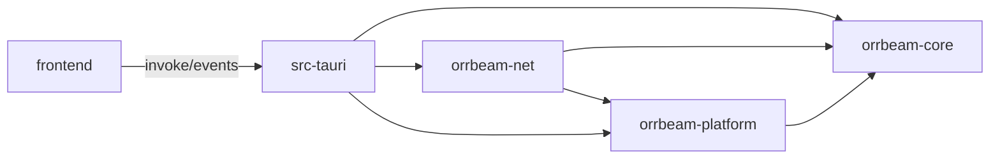

# Orrbeam Architecture

## Overview

Orrbeam is a single desktop application that wraps Sunshine hosting, Moonlight client control, peer discovery, and trusted-peer operations behind one Tauri shell. The backend is a Rust workspace split by responsibility, while the frontend is a React application that talks to the backend only through Tauri IPC commands and emitted events.

## Crate Boundaries

| Area | Responsibility |
| --- | --- |
| `crates/orrbeam-core` | Shared types and primitives: config loading, Ed25519 identity, node models, trusted peers, TLS identity, signing helpers, Sunshine config parsing |
| `crates/orrbeam-net` | Peer discovery, control-plane HTTP client/server logic, nonce and replay protection, mutual-trust flow, signed route middleware |
| `crates/orrbeam-platform` | OS-specific platform abstraction for Linux, macOS, and Windows, including Sunshine/Moonlight detection and process-level integration |
| `src-tauri` | App assembly, shared `AppState`, Tauri command registration, tray integration, background discovery startup, event forwarding |
| `frontend` | React 19 UI, Zustand stores, Tauri invoke wrapper, panel components, settings UI, mesh status presentation |

## Dependency Graph



`src-tauri` is the app composition layer. It owns `AppState`, creates the background discovery manager, boots the signed control server, and exposes command handlers that bridge the frontend into the Rust workspace.

## Data Flow

### Discovery to UI

1. `src-tauri/src/lib.rs` creates a shared `NodeRegistry` and starts `orrbeam_net::DiscoveryManager`.
2. `orrbeam-net` populates the registry from `_orrbeam._tcp` mDNS and orrtellite-backed discovery.
3. `src-tauri/src/commands/discovery.rs` reads the registry and returns node snapshots to the frontend.
4. Frontend stores and panels use that data to render the Moonlight node list and mesh status.

### Control Plane and Trusted Peers

1. The frontend calls remote commands such as `list_trusted_peers`, `request_mutual_trust`, and `connect_to_peer`.
2. `src-tauri` routes those commands through shared state containing `TrustedPeerStore`, TLS identity, and the platform adapter.
3. `orrbeam-net` validates signatures, tracks nonces, exposes mutual-trust endpoints, and performs remote control calls.
4. Control-plane events are emitted back to the frontend through a Tauri event bridge.

### Settings and Platform Actions

1. The frontend reads and writes config through `get_config` and `save_config`.
2. Sunshine and Moonlight actions go through command modules that call into `orrbeam-platform`.
3. Platform implementations map those requests into OS-specific binaries, service checks, and device or monitor metadata.

## Tauri IPC Surface

The current command surface is grouped into seven modules:

- `platform`: host OS, GPU, and monitor inspection
- `sunshine`: status, start/stop, settings, monitor selection
- `moonlight`: client status, start/stop
- `pairing`: PIN-based pairing initiation and acceptance
- `remote`: trusted peers, mutual trust, remote status, connect flow
- `discovery`: node listing and count
- `settings`: config, identity, TLS fingerprint

ASCII view of the boundary:

```text
React components / Zustand stores
            |
            v
frontend/src/api/tauri.ts
            |
            v
Tauri invoke("command_name", args)
            |
            v
src-tauri/src/commands/
  |- platform.rs
  |- sunshine.rs
  |- moonlight.rs
  |- pairing.rs
  |- remote.rs
  |- discovery.rs
  `- settings.rs
            |
            v
AppState
  |- Config
  |- Identity / TLS
  |- NodeRegistry
  |- TrustedPeerStore
  `- Platform implementation
            |
            v
orrbeam-core / orrbeam-net / orrbeam-platform
```

## Node Topology

Orrbeam models the network as a bidirectional mesh:

- Every participating machine can host via Sunshine
- Every participating machine can connect via Moonlight
- Discovery is symmetric; a node can find peers over LAN or mesh VPN
- Trust is explicit; control-plane actions require signed requests plus trusted-peer state

This keeps the user model simple: each machine is a node, not a permanently fixed host or client.

## Protocol Choices

- Sunshine pairing and stream hosting remain the host-side streaming foundation
- Moonlight remains the client-side streaming foundation
- `_orrbeam._tcp` mDNS is the LAN discovery protocol
- Orrtellite/Headscale HTTP APIs provide non-LAN peer discovery
- Signed HTTP control routes plus TLS identity protect peer management and remote actions

## Config File Locations

All paths follow XDG conventions via the [`dirs`](https://docs.rs/dirs) crate.

| File | Default path | Purpose |
| --- | --- | --- |
| Main config | `~/.config/orrbeam/config.yaml` | `Config` struct — bind address, port, discovery settings, orrtellite credentials |
| Trusted peers | `~/.config/orrbeam/trusted_peers.yaml` | `TrustedPeerStore` — do not edit by hand |
| Ed25519 signing key | `~/.local/share/orrbeam/identity/signing.key` | Raw 32-byte key; generated on first run |
| TLS certificate (PEM) | `~/.local/share/orrbeam/identity/control.cert.pem` | Self-signed cert derived from signing key |
| TLS private key (PEM) | `~/.local/share/orrbeam/identity/control.key.pem` | Private key for TLS termination |

The identity and TLS files are generated automatically if absent. Deleting them generates new keys, which will invalidate all existing peer trust relationships (fingerprint changes).

## Control Plane Auth Flow

Every authenticated request goes through three verification layers:

```text
Caller (ControlClient)                    Server (axum middleware)
─────────────────────                     ────────────────────────
1. Serialize body to JSON bytes
2. Compute canonical string:
     METHOD\nPATH\nTIMESTAMP\nNONCE\n
     SHA256(body_bytes_hex)
3. Sign canonical string with
   Ed25519 signing key
4. Attach headers:
     X-Orrbeam-Timestamp: <unix_secs>
     X-Orrbeam-Nonce:     <32 hex chars>
     X-Orrbeam-Signature: <key_id>:<base64_sig>
     X-Orrbeam-Version:   orrbeam/1
5. Send over TLS (pinned cert)
                                          6. TLS terminates; cert is the
                                             node's own self-signed cert
                                          7. Extract timestamp — reject if
                                             |now - timestamp| > 30 s
                                          8. Check nonce cache — reject if
                                             nonce seen before (replay)
                                          9. Insert nonce into cache (TTL 60 s)
                                         10. Resolve key_id → TrustedPeer
                                             from TrustedPeerStore
                                         11. Recompute canonical string
                                             from request fields
                                         12. Verify Ed25519 signature with
                                             peer's stored verifying key
                                         13. Check peer.permissions for
                                             the specific operation
                                         14. Forward to handler or return
                                             401 with error code
```

Endpoints that do not require trust (e.g. `GET /v1/hello`, `POST /v1/mutual-trust-request`) skip steps 10–13 and are handled by the open router.

## Extension Points

### New Platforms

Add a new `Platform` implementation under `crates/orrbeam-platform`, then wire it through `get_platform()` and any OS-gated build logic. Feature additions that touch Sunshine or Moonlight process control should extend the shared trait rather than bypass it from `src-tauri`.

### New Session Modes

Shared-control or future co-op modes should remain above the core identity/config layer and below the Tauri command boundary. That keeps discovery, trusted peers, and signing reusable while allowing new session orchestration in `orrbeam-platform` or an adjacent crate.

### Frontend Growth

Keep the frontend boundary stable by adding new commands to `src-tauri/src/commands` and exposing them through `frontend/src/api/tauri.ts`. Stores should remain the source of truth for panel state rather than embedding async orchestration directly in components.
